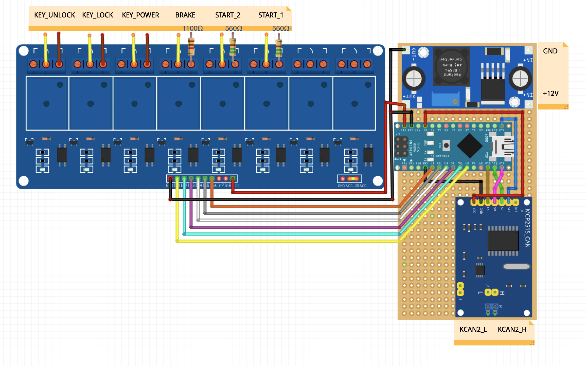

# BMW F30 REMOTE START
BMW F30 Remote start feature with Arduino

# How it works
The Arduino, thanks to the MCP2515 board, constantly listen to the BMW K-CAN2 bus, looking for a triple lock button click. If found, it starts a 18 seconds long operation, during which it does those steps:
- Turns on the in-car keyfob
- Unlocks the car
- Locks the car 
- Virtually presses the start button, turning on the ignition
- Waits some seconds, to let the engine be ready to start.
- Virtually presses the brake and the start button, turning on the engine
- Turns off the in-car key.

# Security issues
**The spare key is always in the car. Wouldn't this be enough to allow a thief to turn on the engine?**

Yes, but actually no. The Arduino turns on the keyfob only when it needs it to remote start. Normally the key isn't powered so the car doesn't see it and can't be turned on!

**Why do the Arduino open and close the car before starting the engine?**

The lock and unlock thing is needed to be able to turn on the ignition. This is because of the BMW security protocol, which disables the possibility of turning on the car if the car wasn't opened before. This is not a security issues though, because this process happens in 2 seconds and the car remains open for just 1 second.

# Required things
Here's a list of things you need for this project:
- Arduino Nano
- LM2596S voltage regulator board
- MCP2515 Canbus board (Niren)
- 6x Relay Board 5V
- 2x 560Ω (to replicate the start button internal 560Ω resistor) 
- 1x 1100Ω (to replicate the 12mA current outputted by the hall sensor inside the brake light switch)

You can get those resistance values by putting more resistors in series and sum the resistance value.
For example:
- to get a 550Ω resistance, you can put 220Ω and 330Ω resistors in series! 
- to get a 1100Ω resistance, you can put 1kΩ and 100Ω resistors in series!

# Wiring

## Car Wiring

**KCAN2**

Attention: the OBD2 port doesn't have KCAN2. You can't use it. You have to take KCAN2 from the FEM
- KCAN2_H: FEM A173\*8B, pin 50
- KCAN2_L: FEM A173\*8B, pin 49

**12V and GND**

Attention: you can't use the 12V plug as power source, you need an always-powered 12V source. You can find it at the FEM.
- 12V: FEM A173\*3B, pin 33
- GND: FEM A173\*3B, pin 6

**Brake Light Switch and Start-Stop Button**

Here you can see how to wire break light switch and start/stop button:

## KeyFob Wiring

**KeyFob Power**

You have to interrupt the battery positive connection, split it in 2 wires and feed them inside the relay:

**KeyFob Lock and Unlock buttons**

You have to simulate the press of the switch using the relay. To do that, just hook to the key switches like that:

## Arduino wiring

You can follow this schematic to build everything:

And this is the final look (it's ugly, I know. You can make it definitely better):

# Credits
autowp for [arduino-mcp2515 library](https://github.com/autowp/arduino-mcp2515)
